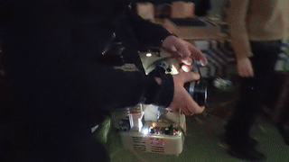
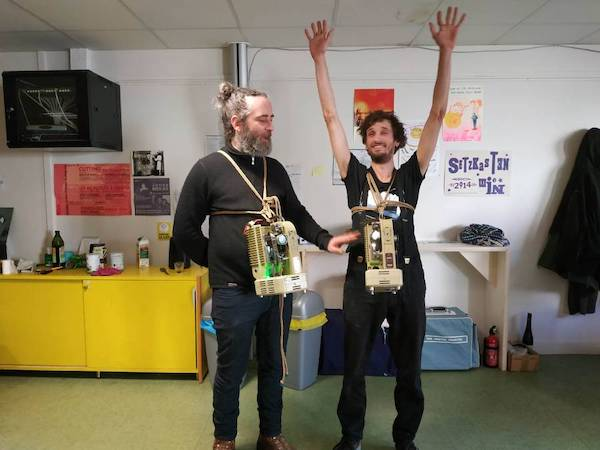
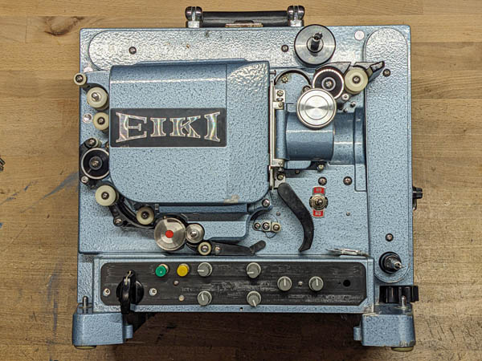

# film-projector-retrofit

##This is a development platform to support the [Wandering 16mm Projector Retrofit WIKI](https://www.filmlabs.org/wiki/en/meetings_projects/spectral/mire-wandering/wandering-16mmprojection/start) on filmlabs.org. Go there for complete documentation.

----

**Make a 16mm film projector portable and playable like an instrument. Retrofit with a DC motor and LED lamp, controlled by ESP32 micro-controller.**
This project is part of [SPECTRAL Wandering Sounds and Images Seminar](https://www.mire-exp.org/evenement/spectral-wandering-sound-and-images/) in Nantes FR in 2023/2024, enabling film projection performances that explore itinerancy, nomadism, and adaptation to multiple environments.

----

Contents
======

[docs](https://github.com/z-l-p/film-projector-retrofit/tree/main/docs) 
---- 

 - [Bill of Materials (BOM)](https://www.filmlabs.org/wiki/en/meetings_projects/spectral/mire-wandering/wandering-16mmprojection/budget) (filmlabs.org) or [Google Sheets alternate](https://docs.google.com/spreadsheets/d/1z_asHddtIuv7a7RkZ9WCBqF81oMiJ9spwqh7lCQfW5E) 
	
 - [Step-by-step Construction Guide](https://www.filmlabs.org/wiki/en/meetings_projects/spectral/mire-wandering/wandering-16mmprojection/construction_guide/start) for building and using the projector (filmlabs.org)
	
 - [Construction Photos](https://github.com/z-l-p/film-projector-retrofit/tree/main/docs/images)
	
 - [Diagrams](https://github.com/z-l-p/film-projector-retrofit/tree/main/docs/diagrams)
 
 - [Datasheets](https://github.com/z-l-p/film-projector-retrofit/tree/main/docs/datasheets)

[openscad](https://github.com/z-l-p/film-projector-retrofit/tree/main/openscad)
----

 - Editable design files for 3D-printed parts (in OpenSCAD format)

[projector\_code](https://github.com/z-l-p/film-projector-retrofit/tree/main/projector_code)
----

 - Code for the ESP32 micro-controller that controls the projector (Arduino IDE)

[stl](https://github.com/z-l-p/film-projector-retrofit/tree/main/stl)
----

 - Printable files for 3D-printed parts (rendered from openscad)
 
 ----
 
 
 
 

