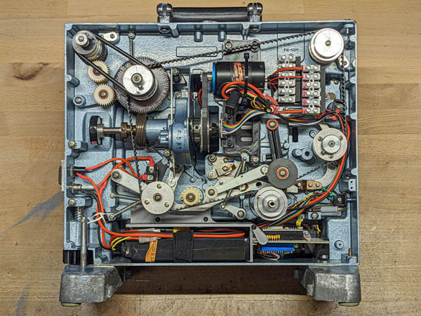

# film-projector-retrofit

An attempt to modernize a 16mm film projector with DC motor and LED lamp, controlled by ESP32 micro-controller. This project is part of SPECTRAL Wandering Sounds and Images Seminar https://www.mire-exp.org/evenement/spectral-wandering-sound-and-images/

This info is a work-in-progress, and designed to work with specific hardware. It won't be stable until February 2024 when it will appear on this wiki: https://www.filmlabs.org/wiki/en/meetings_projects/spectral/mire-wandering/wandering-16mmprojection/start

Contents
======

[docs](https://github.com/z-l-p/film-projector-retrofit/tree/main/docs) 
---- 

 - [Bill of Materials](https://docs.google.com/spreadsheets/d/1z_asHddtIuv7a7RkZ9WCBqF81oMiJ9spwqh7lCQfW5E) (Google Sheets link, to be replaced by static CSV file)
	
 - [Step-by-step instructions](https://github.com/z-l-p/film-projector-retrofit/blob/main/docs/index.md) for building and using the projector
	
 - [Construction Photos](https://github.com/z-l-p/film-projector-retrofit/tree/main/docs/images)
	
 - [Diagrams](https://github.com/z-l-p/film-projector-retrofit/tree/main/docs/diagrams)
 
 - [Datasheets](https://github.com/z-l-p/film-projector-retrofit/tree/main/docs/datasheets)
	
 - The build guide is also availabe via direct link: https://z-l-p.github.io/film-projector-retrofit/

[openscad](https://github.com/z-l-p/film-projector-retrofit/tree/main/openscad)
----

 - Editable design files for 3D-printed parts (in OpenSCAD format)

[projector\_code](https://github.com/z-l-p/film-projector-retrofit/tree/main/projector_code)
----

 - Code for the ESP32 micro-controller that controls the projector (Arduino IDE)

[stl](https://github.com/z-l-p/film-projector-retrofit/tree/main/stl)
----

 - Printable files for 3D-printed parts (rendered from openscad)

