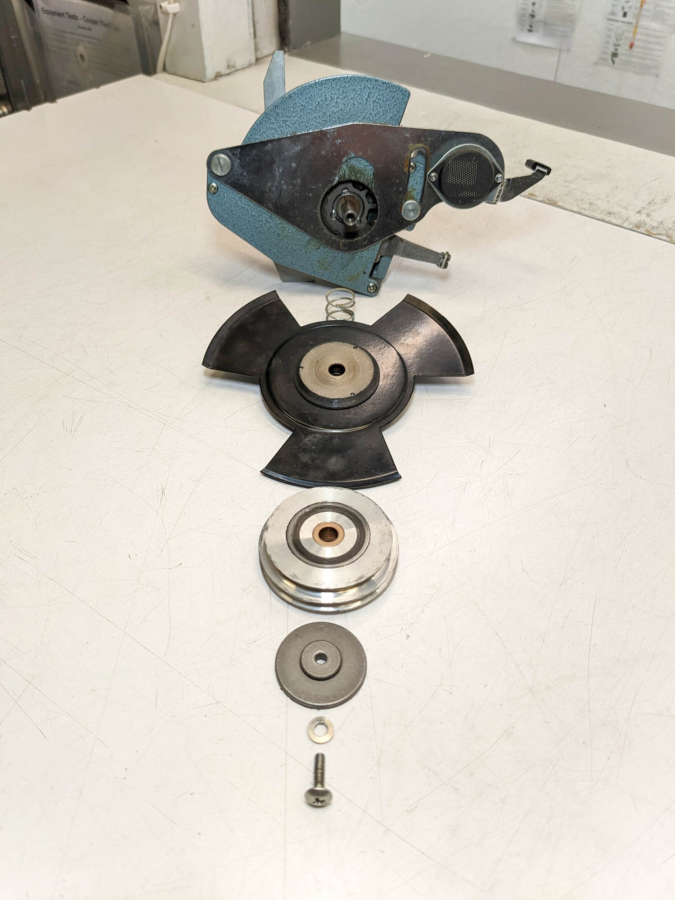

**Spectral Projector Conversion Guide**

(Work In Progress! Composed in markdown format for github, to be adapted to filmlabs.org wiki)

Summary
=======

What we are doing and why

Major parts diagram

Theory of Operation and how the parts interact to make it all work

Preparation
===========

Purchase parts from the BOM

Test and lubricate projector before disassembly

Remove unused parts

Drill holes in projector frame (before installing any delicate stuff)

3D print new parts

Power Wiring
============

Consult the main diagram for the basic flow.

There are 2 possible power sources: A 12V DC adapter with standard coaxial jack or a 3S LiPo battery. A 3-position SPDT switch selects DC / OFF / Battery.

All wiring should be 18AWG (?mm) or larger, because there are high currents involved.

Mount switch, DC jack, and fuse holder in the holes you drilled in projector chassis.

Add an XT60 male connector (wires must be long enough to reach battery) and wire the switch so it selects between DC and battery.

Prepare a 5-position segment (update this to add more because we need regulator too) of eurostrip terminal block. It will be mounted on the chassis near the lamp.

Power will flow from the switch through the fuse and into the terminal strip, then branch out to each major subsystem.

Camtank and Shutter Pulley
==========================

The camtank contains the pulldown claw mechanism. The original shutter and pulley mounts to the outside, with a still frame clutch lever in between. We will remove the pulley, shutter and clutch mechanism. We will replace the pulley with a new one, and mount the encoder magnet on the shaft. 

1) Remove the screw on the end of the pulley. This should release the pulley, shutter, and other hardware.

2) Remove the screws around the camtank perimeter. Lift the camtank lid to reveal the inside.

3) Clean the old grease from the cam, follower, and felt pad. Pack with new grease (Superlube) and lubricate the fulcrum. Add info from service manual.

4) Check the tension on the spring that keeps the follower on the cam. Use a digital luggage scale or tension scale to check force required to lift pulldown claw away from cam. It should be 1.1 - 1.25 kg. (Carefully widen the spring coil to reduce tension if needed.) Consult service manual.

5) The still frame clutch lever needs to be removed from the camtank cover. The screw may be very tight, so be careful not to strip the head.

6) Use the 3D-printed camtank cover (STL filename?) to cover the large hole in the camtank cover, then replace the cover.

7) Attach the 80 tooth pulley to the camtank shaft (with ? mm of shaft exposed at the end?) and tighten the screws firmly. If the pulley seems off-center, try shimming it with small piece of aluminum from a beer / soda can.

8) There are two 3D-printed parts for the magnet assembly (STL filenames?). Both should be printed at 1mm resolution and tested since they have small mating threads. Use CA glue to attach the sensor magnet to the cap. The base should attach to the camtank shaft using an M4 x 10mm screw. (The original Eiki screw is too long.) Tighten M4 screw and use threadlocker. Screw the cap onto the base until finger-tight.

9) Install the camtank in projector using original Eiki screws. (It may need adjustment later, after test film is loaded.)

Motor Prep and Wiring
=====================

The Hobbywing "Quicrun SE" 1200kv motor is made for radio controlled trucks. It is a brushless DC motor with built-in ESC (speed control) and uses FOC (field oriented control) to create smooth movement at low RPM while maintaining high torque. This is a big benefit for projection at slow speeds. (Other "540 size" DC motors and ESCs will also work, but they probably won't move smoothly at low speeds.)

The micro-controller will send a PWM signal to "impersonate" an RC receiver, but there are several things we need to do to prepare the motor first.

- Describe modification of power switch

- Describe motor programming (either by card or maybe automatically via ESP32 code?)

Motor Installation
==================

1) Screw the motor to aluminum motor mount.

2) Attach 16 tooth pulley to motor shaft using 1/8" to 5mm adapter. If the pulley seems off-center, try shimming it with small piece of aluminum from a beer / soda can. NEED PHOTO.

3) Prepare 3D-printed motor bracket (STL filename?) by inserting M3 nuts into the underside pockets. These will be for the encoder bracket added later.

4) Use three M3 x 6mm screws and washers to attach motor mount to 3D-printed bracket. At least one must be a low profile screw head that fits into a recessed pocket, as shown in photo. NEED BETTER PHOTO.

5) Loosely attach motor mount to projector using the 3 original Eiki screws. It should slide freely in the vertical dimension. If it won't slide, check the back of the mount to see if a screw head is striking some hardware on the projector.

6) Attach the 232mm belt to the pulleys and check to see if the belt is centered. If not, adjust the pulleys on their shafts until it works. Then apply thread-locker to the set-screws on all pulleys.

Encoder Wiring
==============

The AS5047D magnetic encoder senses the rotation of a small magnet (to be mounted to the shutter shaft) and reports its angular position to the micro-controller. (There are cheaper and more common magnetic encoders like the AS5600 but they don't support the high RPM we need.) The AS5047D communicates using 2 interfaces:

**SPI** is used for sensor setup and polling the sensor for the absolute position of the shaft. It's a slow protocol so we only use it while the projector is stopped.

**ABI** is a quadrature signal (A,B) and an index pulse (I) that updates 100 times for each revolution of the shutter shaft. These pulses trigger an interrupt routine on the microcontroller that keeps track of the shutter shaft position and direction with high accuracy.

The sensor comes on an adapter board (AS5047D-TS_EK_AB) that needs preparation before installation:

1) Snip off the 3-pin jumper headers on the front of the sensor board (JP1). No need to desolder.

2) Use a small wire to bridge the right 2 pads of JP1.  
Remove resistor R1 (actually a 0 ohm jumper).  
Bridge the R2 pads.  

3) Solder 9 wires (on the back of the board) for micro-controller connections:

3V3, CLK, MOSI, MISO, GND  
B, A, I, V  
(see AS5047D-TS_EK_AB datasheet for full pinout info because the PCB markings are confusing)

NEED PICTURE OF WIRING ON BACK OF BOARD

4) Mount the encoder board to the 3D-printed encoder bracket (STL filename?) using two M2.3 x 5mm self-tapping screws.

Encoder Mounting
================

Mount the encoder bracket to the motor bracket with two M3 x 8mm screws and washers. Adjust bracket so sensor chip is a few mm away from spinning magnet and centered in both dimensions. (Add washers behind encoder bracket if you need to move it closer to you.)

h1 { margin-bottom: 0.08in }h1.western { font-family: "Arial", sans-serif; font-size: 18pt }h1.cjk { font-family: "Arial"; font-size: 18pt }h1.ctl { font-family: "Arial"; font-size: 18pt }p { margin-bottom: 0.1in; line-height: 120% }